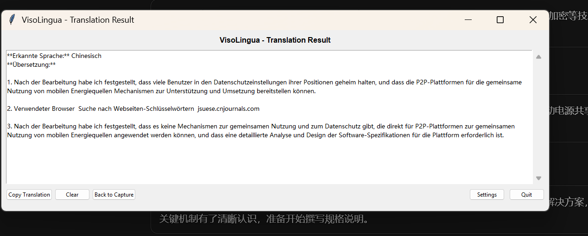

# VisoLingua - Live Translation Overlay Tool

A user-friendly desktop tool for live translation with transparent overlay window, optimized for Chinese texts.

## Screenshots

### Scan Window (Capture Mode)

*Transparent overlay window for capturing text for translation*

### Translation Result

*Result window with translated text output*

## 🚀 Available Implementations

VisoLingua is available in **three implementations** with different trade-offs:

| Version | Status | Binary Size | Startup | Best For | Link |
|---------|--------|-------------|---------|----------|------|
| **🐍 Python** | ✅ **Working** | ~50 MB | ~2-3s | Development, quick iteration | *(this directory)* |
| **🦀 Rust** | ✅ **Working** | **~8 MB** | **~0.5s** | **Production use** ⭐ | [visolingua-rust/](visolingua-rust/) • [Releases](../../releases) |
| **🐹 Go** | ⚠️ **Broken** | ~12 MB | ~1s | Not recommended | [visolingua-go/](visolingua-go/) |

### 📦 Download Pre-built Binaries

**[→ Download Latest Release](../../releases/latest)** - Get the Rust version (recommended)

### Quick Recommendations

- **🎯 For end users**: Use the **[Rust version](visolingua-rust/)** - smallest, fastest, most reliable
- **👨‍💻 For developers**: Use the **Python version** - easiest to modify and test
- **⚠️ Avoid**: The **Go version** has critical screen capture bugs and is not functional

### Version Details

**Python (Original)**
- ✅ Fully working, well-tested
- ✅ Easy to modify and extend
- ✅ All features implemented
- ❌ Larger binary size
- ❌ Requires Python runtime

**Rust + Tauri (Recommended)**
- ✅ Production-ready
- ✅ Smallest binary (~8 MB)
- ✅ Fastest startup
- ✅ No runtime dependencies
- ✅ No antivirus false positives
- ❌ Longer build times (~5 min)

**Go + Wails (Experimental)**
- ⚠️ **NOT WORKING** - screen capture broken
- ❌ Only captures app window, not user's screen
- ❌ Unusable for translation purposes
- 📝 Kept as reference implementation

See each version's README for detailed setup instructions.

---

## Features

### 🎯 **Core Functions**
- **Transparent Capture Window**: Movable and resizable over other applications
- **LLM Integration**: Supports Gemini 2.5 Flash and GPT-4 Mini/Nano
- **One-Click Translation**: Simply click in the overlay window
- **Dual-Mode System**: Seamless switching between capture and result mode
- **🤖 Ask AI**: Ask questions about translation results for context, explanations and details

### 🌏 **Language Support**
- **Chinese Focus**: Optimized for simplified and traditional Chinese characters
- **Automatic Language Detection**: Automatically detects source language
- **Multilingual**: Supports many languages → German

### ⚡ **Performance & UX**
- **Intelligent Caching**: Identical screenshots are not translated again
- **History**: Storage and retrieval of recent translations
- **Cross-Platform**: Windows, Linux, macOS
- **DPI-Aware**: Perfect rendering on High-DPI displays

## 🚀 Quick Start

### Installation

#### Option 1: Direct with Python (Recommended)
```bash
# 1. Clone repository
git clone https://github.com/username/VisoLingua.git
cd VisoLingua

# 2. Install Python 3.8+ (if not already installed)
# 3. Install dependencies
pip install -r requirements.txt

# 4. Start app
python main.py
```

#### Option 2: Create Local EXE
```bash
# After installing dependencies:
python build_exe.py
# Creates dist/VisoLingua.exe (may trigger antivirus warnings)
```

### Initial Setup
```bash
# 1. Create configuration file
cp config/config_sample.ini config/config.ini

# 2. Enter API keys (edit config/config.ini)
# - Gemini API Key from https://aistudio.google.com/
# - Or OpenAI API Key from https://platform.openai.com/

# 3. Start app
python main.py

# On first start:
# 1. Check/enter API key in Settings
# 2. Select default LLM (recommended: Gemini 2.5 Flash)
# 3. Done!
```

### Configure API Keys
- **Gemini API**: [Google AI Studio](https://aistudio.google.com/) → Create API Key
- **OpenAI API**: [OpenAI Platform](https://platform.openai.com/) → Create Secret Key

## 💡 Usage

### Basic Operation
1. **Start app**: `python main.py`
2. **Position scan window**: Drag over the text to be translated
3. **Take screenshot**: Click in the red overlay window
4. **Get translation**: Automatic switch to result window
5. **🤖 Ask AI** (optional): Enter question about translation in text field and click "Ask AI"
6. **Back to scan**: "Back to Capture" button or close window

### Ask AI Function
After a translation, you can ask the AI questions about the result:
- **Examples**: "What does this context mean?", "Are there alternative translations?", "Explain the grammar"
- **Response**: Displayed directly in the result window below the original translation
- **Usage**: Same LLM configuration as for translations (Gemini/OpenAI/Ollama)

### Switch Modes
- **Double-click** on overlay title bar → To result window
- **"Back to Capture"** button → Back to scan window
- **Close window** → Back to scan window
- **X-button on overlay** → Exit app

### Hotkeys & Shortcuts
- `Ctrl+Tab`: Switch between modes
- `Ctrl+C`: Copy translation (in result mode)
- `Esc`: Close result window (back to capture)
- **Double-click title bar**: Switch mode

## Project Structure

```
VisoLingua/
├── main.py              # Main program
├── config/
│   ├── settings.py      # Configuration management
│   ├── config.ini       # User settings (created locally)
│   └── config_sample.ini # Configuration template
├── ui/
│   ├── overlay.py       # Transparent overlay
│   └── result_window.py # Result window with Ask AI function
├── core/
│   ├── screenshot.py    # Screenshot capture
│   └── translator.py    # LLM integration
├── utils/
│   ├── helpers.py       # Helper functions
│   └── constants.py     # Constants
└── requirements.txt     # Dependencies
```

## 🤖 Supported LLMs

### ☁️ Cloud LLMs (API Keys Required)

| LLM | Speed | Cost | Quality | Recommendation |
|-----|-------|------|---------|----------------|
| **Gemini 2.5 Flash** | ⚡⚡⚡ | 💰 | ⭐⭐⭐⭐ | ✅ **Recommended** |
| **GPT-4.1 Mini** | ⚡⚡ | 💰💰 | ⭐⭐⭐⭐⭐ | For best quality |
| **GPT-4.1 Nano** | ⚡⚡⚡ | 💰 | ⭐⭐⭐ | Experimental |

### 🏠 Local LLMs with Ollama (100% private, free)

| Model | Parameters | Downloads | Performance | Chinese | Description |
|-------|-----------|-----------|-------------|---------|-------------|
| **gemma3** | 1b-27b | 9.4M | ⚡⚡⚡ | ⭐⭐⭐ | Latest model for single GPU |
| **qwen2.5-vl** | 3b-72b | 400K | ⚡⚡⚡ | ⭐⭐⭐⭐⭐ | Qwen's flagship vision model |
| **llava** | 7b-34b | 7.9M | ⚡⚡ | ⭐⭐⭐⭐ | Proven vision-language model |
| **minicpm-v** | 8b | 2.4M | ⚡⚡ | ⭐⭐⭐⭐ | Compact multimodal model |
| **llama3.2-vision** | 11b-90b | 2.2M | ⚡⚡ | ⭐⭐⭐ | Meta's vision model |
| **llava-llama3** | 8b | 1.3M | ⚡⚡ | ⭐⭐⭐⭐ | LLaVA with Llama 3 base |
| **llama4** | 16x17b-128x17b | 467K | ⚡ | ⭐⭐⭐ | Meta's latest multimodal model |
| **moondream** | 1.8b | 223K | ⚡⚡⚡ | ⭐⭐ | Optimized for edge devices |

#### Ollama Setup:
```bash
# 1. Install Ollama (https://ollama.ai)
# 2. Pull model (example):
ollama pull llava:7b

# 3. In VisoLingua: Settings → Local Ollama → Enable
```

## 📋 System Requirements

### Minimum (Cloud LLMs)
- **Python**: 3.8+
- **Operating System**: Windows 10+, Linux (GUI), macOS 10.14+
- **RAM**: 2GB available
- **Internet**: For LLM API calls

### Recommended (Cloud LLMs)
- **Python**: 3.9+
- **RAM**: 4GB+
- **Display**: 1920x1080+ (High-DPI supported)
- **Internet**: Stable broadband connection

### Local LLMs (Ollama)
- **GPU**: NVIDIA with 6GB+ VRAM (recommended) or CPU-only
- **RAM**: 16GB+ (depends on model, see table above)
- **Storage**: 5-40GB for models
- **Ollama**: Installed and running locally

## 🛠️ Technical Details

### Architecture
- **Frontend**: tkinter (Cross-Platform GUI)
- **Screenshot**: mss + PIL ImageGrab (Fallback)
- **LLM APIs**: aiohttp (Async requests)
- **Threading**: Async/await for non-blocking UI

### Special Features
- **Thread-safe screenshot capture** with MSS fallbacks
- **DPI-Awareness** for Windows High-DPI displays
- **Intelligent caching** with MD5 hash comparison
- **Robust error handling** with multiple fallback methods

### Inspired by
- [OverText](https://github.com/thiswillbeyourgithub/OverText) - Transparent overlay functionality
- Developed for defensive security purposes and language learning support

## ⚠️ Important Security Notes

**USE AT YOUR OWN RISK!**

We cannot guarantee that the application is error-free and always only sends the selected scan area to the LLM. To ensure maximum privacy and security, using a local, self-hosted LLM for translation is recommended when in doubt.

### 🛡️ Anti-Virus False-Positives
PyInstaller EXE files are often incorrectly detected as viruses. **Recommendation: Use Python directly** (`python main.py`) instead of an EXE file.

### 🏠 Local LLM Alternative (available!)
VisoLingua now supports **Ollama** for completely private translations without external API calls. Enable local LLMs in the settings.

## 🆘 Support & Troubleshooting

### Common Issues
- **Window not visible**: Adjust transparency in `config.ini`
- **Screenshot error**: Start app with administrator rights
- **API error**: Check API key and internet connection
- **DPI problems**: Automatically fixed with DPI-Awareness

For detailed solutions see: [SETUP.md](SETUP.md)

## 📄 License

This project is exclusively for **defensive security purposes** and **language learning support**.