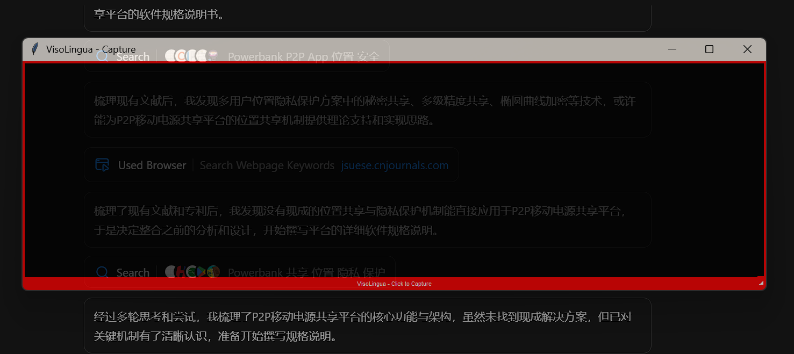

# VisoLingua - Live Translation Overlay Tool

Ein benutzerfreundliches Desktop-Tool für Live-Übersetzung mit transparentem Overlay-Fenster, optimiert für chinesische Texte.

## Screenshots

### Scan-Fenster (Capture-Modus)

*Transparentes Overlay-Fenster zum Erfassen von Text für die Übersetzung*

### Übersetzungsergebnis

*Ergebnis-Fenster mit der übersetzten Text-Ausgabe*

## Features

### 🎯 **Kernfunktionen**
- **Transparentes Capture-Fenster**: Verschiebbar und größenverstellbar über anderen Anwendungen
- **LLM-Integration**: Unterstützt Gemini 2.5 Flash und GPT-4 Mini/Nano  
- **Ein-Klick-Übersetzung**: Einfach in das Overlay-Fenster klicken
- **Dual-Modus-System**: Nahtloser Wechsel zwischen Capture- und Ergebnis-Modus

### 🌏 **Sprachunterstützung**
- **Chinesisch-Fokus**: Optimiert für vereinfachte und traditionelle chinesische Zeichen
- **Automatische Spracherkennung**: Erkennt Quellsprache automatisch
- **Mehrsprachig**: Unterstützt viele Sprachen → Deutsch

### ⚡ **Performance & UX**
- **Intelligentes Caching**: Identische Screenshots werden nicht erneut übersetzt
- **Verlauf**: Speicherung und Abruf der letzten Übersetzungen
- **Cross-Platform**: Windows, Linux, macOS
- **DPI-Aware**: Perfekte Darstellung auf High-DPI-Displays

## 🚀 Quick Start

### Installation
```bash
# 1. Repository klonen oder herunterladen
# 2. Python 3.8+ installieren
# 3. Dependencies installieren
pip install -r requirements.txt
```

### Erste Einrichtung
```bash
# App starten
python main.py

# Bei erstem Start:
# 1. API-Schlüssel in Settings eingeben
# 2. Standard-LLM auswählen (empfohlen: Gemini 2.5 Flash)
# 3. Fertig!
```

### API-Schlüssel konfigurieren
- **Gemini API**: [Google AI Studio](https://aistudio.google.com/) → API Key erstellen
- **OpenAI API**: [OpenAI Platform](https://platform.openai.com/) → Secret Key erstellen

## 💡 Verwendung

### Grundlegende Bedienung
1. **App starten**: `python main.py`
2. **Scan-Fenster positionieren**: Über den zu übersetzenden Text ziehen
3. **Screenshot aufnehmen**: Ins rote Overlay-Fenster klicken
4. **Übersetzung erhalten**: Automatischer Wechsel zum Ergebnis-Fenster
5. **Zurück zum Scan**: "Back to Capture" Button oder Fenster schließen

### Modi wechseln
- **Doppelklick** auf Overlay-Titelleiste → Zum Ergebnis-Fenster
- **"Back to Capture"** Button → Zurück zum Scan-Fenster
- **Fenster schließen** → Zurück zum Scan-Fenster
- **X-Button am Overlay** → App beenden

### Hotkeys & Shortcuts
- `Strg+Tab`: Zwischen Modi wechseln
- `Strg+C`: Übersetzung kopieren (im Ergebnis-Modus)
- `Esc`: Ergebnis-Fenster schließen (zurück zu Capture)
- **Doppelklick Titelleiste**: Mode wechseln

## Projektstruktur

```
VisoLingua/
├── main.py              # Hauptprogramm
├── config/
│   ├── settings.py      # Konfigurationsverwaltung
│   └── config.ini       # Benutzereinstellungen
├── ui/
│   ├── overlay.py       # Transparentes Overlay
│   └── result_window.py # Ergebnisfenster
├── core/
│   ├── screenshot.py    # Screenshot-Erfassung
│   └── translator.py    # LLM-Integration
├── utils/
│   ├── helpers.py       # Hilfsfunktionen
│   └── constants.py     # Konstanten
└── requirements.txt     # Dependencies
```

## 🤖 Unterstützte LLMs

### ☁️ Cloud LLMs (API-Keys erforderlich)

| LLM | Geschwindigkeit | Kosten | Qualität | Empfehlung |
|-----|----------------|--------|----------|------------|
| **Gemini 2.5 Flash** | ⚡⚡⚡ | 💰 | ⭐⭐⭐⭐ | ✅ **Empfohlen** |
| **GPT-4.1 Mini** | ⚡⚡ | 💰💰 | ⭐⭐⭐⭐⭐ | Für beste Qualität |
| **GPT-4.1 Nano** | ⚡⚡⚡ | 💰 | ⭐⭐⭐ | Experimentell |

### 🏠 Lokale LLMs mit Ollama (100% privat, kostenlos)

| Modell | Parameter | Downloads | Performance | Chinesisch | Beschreibung |
|--------|-----------|-----------|-------------|------------|-------------|
| **gemma3** | 1b-27b | 9.4M | ⚡⚡⚡ | ⭐⭐⭐ | Aktuellstes Modell für Single-GPU |
| **qwen2.5-vl** | 3b-72b | 400K | ⚡⚡⚡ | ⭐⭐⭐⭐⭐ | Flagship Vision-Modell von Qwen |
| **llava** | 7b-34b | 7.9M | ⚡⚡ | ⭐⭐⭐⭐ | Bewährtes Vision-Sprachmodell |
| **minicpm-v** | 8b | 2.4M | ⚡⚡ | ⭐⭐⭐⭐ | Kompaktes multimodales Modell |
| **llama3.2-vision** | 11b-90b | 2.2M | ⚡⚡ | ⭐⭐⭐ | Meta's Vision-Modell |
| **llava-llama3** | 8b | 1.3M | ⚡⚡ | ⭐⭐⭐⭐ | LLaVA mit Llama 3 Basis |
| **llama4** | 16x17b-128x17b | 467K | ⚡ | ⭐⭐⭐ | Meta's neuestes multimodales Modell |
| **moondream** | 1.8b | 223K | ⚡⚡⚡ | ⭐⭐ | Optimiert für Edge-Geräte |

#### Ollama Setup:
```bash
# 1. Ollama installieren (https://ollama.ai)
# 2. Modell pullen (Beispiel):
ollama pull llava:7b

# 3. In VisoLingua: Settings → Local Ollama → Enable
```

## 📋 Systemanforderungen

### Minimum (Cloud LLMs)
- **Python**: 3.8+
- **Betriebssystem**: Windows 10+, Linux (GUI), macOS 10.14+
- **RAM**: 2GB verfügbar
- **Internet**: Für LLM-API-Calls

### Empfohlen (Cloud LLMs) 
- **Python**: 3.9+
- **RAM**: 4GB+
- **Display**: 1920x1080+ (High-DPI unterstützt)
- **Internet**: Stabile Breitbandverbindung

### Lokale LLMs (Ollama)
- **GPU**: NVIDIA mit 6GB+ VRAM (empfohlen) oder CPU-only
- **RAM**: 16GB+ (je nach Modell, siehe Tabelle oben)
- **Speicher**: 5-40GB für Modelle
- **Ollama**: Installiert und läuft lokal

## 🛠️ Technische Details

### Architektur
- **Frontend**: tkinter (Cross-Platform GUI)
- **Screenshot**: mss + PIL ImageGrab (Fallback)
- **LLM-APIs**: aiohttp (Async requests)
- **Threading**: Async/await für Non-blocking UI

### Besondere Features
- **Thread-safe Screenshot-Erfassung** mit MSS-Fallbacks
- **DPI-Awareness** für Windows High-DPI-Displays  
- **Intelligentes Caching** mit MD5-Hash-Vergleich
- **Robuste Fehlerbehandlung** mit mehreren Fallback-Methoden

### Inspiriert von
- [OverText](https://github.com/thiswillbeyourgithub/OverText) - Transparente Overlay-Funktionalität
- Entwickelt für defensive Sicherheitszwecke und Sprachlernunterstützung

## ⚠️ Wichtige Sicherheitshinweise

**VERWENDUNG AUF EIGENE GEFAHR!**

Wir können nicht garantieren, dass die Applikation fehlerfrei ist und immer nur den ausgewählten Scan-Bereich an das LLM sendet. Zur Gewährleistung maximaler Privatsphäre und Sicherheit ist im Zweifel die Verwendung eines lokalen, selbst gehosteten LLM für die Übersetzung angeraten.

### 🏠 Lokale LLM-Alternative (verfügbar!)
VisoLingua unterstützt jetzt **Ollama** für vollständig private Übersetzungen ohne externe API-Calls. Aktivieren Sie lokale LLMs in den Einstellungen.

## 🆘 Support & Troubleshooting

### Häufige Probleme
- **Fenster nicht sichtbar**: Transparenz in `config.ini` anpassen
- **Screenshot-Fehler**: App läuft mit Administrator-Rechten starten
- **API-Fehler**: API-Schlüssel und Internetverbindung prüfen
- **DPI-Probleme**: Automatisch behoben mit DPI-Awareness

Ausführliche Lösungen siehe: [SETUP.md](SETUP.md)

## 📄 Lizenz

Dieses Projekt dient ausschließlich **defensiven Sicherheitszwecken** und **Sprachlernunterstützung**.